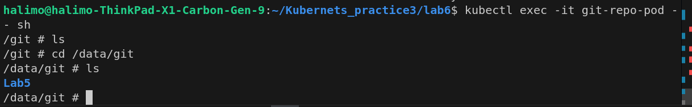

## Requested Report 
Nodeport services are assigned a ClusterIp that can be accessed within the cluster through it that can then forward to the 3 worker nodes selected by it.

## Lab 5
----------------------
- What is a Service in Kubernetes, and why is it needed?

a Service is a method for exposing a network application that is running as one or more Pods in your cluster.

- What are the different types of Services in Kubernetes (e.g., ClusterIP, NodePort) and what are their use cases?

ClusterIP
    Exposes the Service on a cluster-internal IP. Choosing this value makes the Service only reachable from within the cluster. This is the default that is used if you don't explicitly specify a type for a Service. You can expose the Service to the public internet using an Ingress or a Gateway.
NodePort
    Exposes the Service on each Node's IP at a static port (the NodePort). To make the node port available, Kubernetes sets up a cluster IP address, the same as if you had requested a Service of type: ClusterIP.
LoadBalancer
    Exposes the Service externally using an external load balancer. Kubernetes does not directly offer a load balancing component; you must provide one, or you can integrate your Kubernetes cluster with a cloud provider.
ExternalName
    Maps the Service to the contents of the externalName field (for example, to the hostname api.foo.bar.example). The mapping configures your cluster's DNS server to return a CNAME record with that external hostname value. No proxying of any kind is set up.

- what ar LoadBalancer, ExternalName service in kuberenetes and what are their use cases?
LoadBalancer
    Exposes the Service externally using an external load balancer. Kubernetes does not directly offer a load balancing component; you must provide one, or you can integrate your Kubernetes cluster with a cloud provider.
ExternalName
    Maps the Service to the contents of the externalName field (for example, to the hostname api.foo.bar.example). The mapping configures your cluster's DNS server to return a CNAME record with that external hostname value. No proxying of any kind is set up.

- How does a Kubernetes Service use selectors to identify the Pods it routes traffic to? Can a Service be created without a selector?
Using label to compare values like name and color
It can be but the service will assign to any pod available in the cluster
- Explain how a NodePort service works in Kubernetes. What are its advantages and limitations?
assigns all pods with a static port .Its limitations are the port limits of 30000-32727 for external connection.
Its advantages is that it load balances among the available pods and exposes them using a static port number 

- What is a Headless Service in Kubernetes, and when would you use it? How does it differ from a standard ClusterIP service?
Sometimes you don't need load-balancing and a single Service IP. In this case, you can create what are termed headless Services, by explicitly specifying "None" for the cluster IP address (.spec.clusterIP).

You can use a headless Service to interface with other service discovery mechanisms, without being tied to Sometimes you don't need load-balancing and a single Service IP. In this case, you can create what are termed headless Services, by explicitly specifying "None" for the cluster IP address (.spec.clusterIP).

You can use a headless Service to interface with other service discovery mechanisms, without being tied to Kubernetes' implementation.Kubernetes' implementation.
The difference is that the standard has a clusterip assigned to it and can be only accessed from within the cluster.

- Create a ClusterIP Service:
	Write a YAML definition for a ClusterIP service that exposes a deployment named my-app running on port 8080. Ensure the service maps to port 80 inside the cluster.
	[Part1](lab5/p1.yaml)
- Set up a NodePort Service:
	Create a NodePort service that exposes a deployment named backend on port 30001 of each node. 
[Part2](lab5/p2.yaml)
[Pod to test](lab5/p2.1.yaml)

- Test Service with Selectors:
	Create a ClusterIP service named web-service with the selector app: 0ld-web. Deploy two sets of Pods, one with the label app: old-web and another with the label app: api. Verify that only the web Pods receive traffic.
    [first pod](lab5/p3.1.yaml) [the selector](lab5/p3.yaml) [second pod](lab5/3.2.yaml)
The api deployment : 

old-web : 

- Change Service Selector:
	Update an existing service to change its selector from app: old-web to app: new-web. Verify that the traffic is now routed only to Pods with the new label.
[updated yaml to update the selector](lab5/p3.4.yaml)

- Configure a Service for Multiple Ports:
	Define a service that exposes multiple ports (e.g., 80 for HTTP and 443 for HTTPS) on a deployment named multi-port-app "get the front in app from your own choice". Verify both ports are accessible within the cluster.
https port closed from nginx

[Deployment Config file](lab5/p3.5.yaml)
[Service Config file](lab5/p3.6.yaml)
## Lab 6
1- What is a volume in Kubernetes, and how does it differ from a container's storage?
 a directory containing data accessible to containers in a given pod.

2- What are the different types of volumes available in Kubernetes? Describe at least three types and their use cases.

3- How do PersistentVolumes (PVs) and PersistentVolumeClaims (PVCs) work together in Kubernetes? Explain their relationship and purpose.

4- Create a Pod with an emptyDir volume:
	Write a YAML definition for a Pod that uses an emptyDir volume to share data between two containers within the Pod. Deploy the Pod and verify that the data is shared.

[Config file](<lab 6/p1.yaml>)
5- Set up a Pod with a hostPath volume:
	Define a Pod that mounts a hostPath volume to access files from the host node’s file system. Deploy the Pod and verify that it can read/write to the specified directory on the host.

[config file](<lab 6/p2.yaml>)

6- Deploy a PersistentVolume (PV) and PersistentVolumeClaim (PVC):
	Create a YAML file to define a PersistentVolume of 5Gi with ReadWriteOnce access mode. Then, create a PersistentVolumeClaim requesting 2Gi of storage from this PV. Deploy both resources and verify the PVC is bound to the PV.

[PVC](<lab 6/p3.1.yaml>)
[PV](<lab 6/p3.2.yaml>)

7- Create a Pod that uses a PVC:
	Write a YAML definition for a Pod that uses the PVC created in Exercise 3. Mount the PVC to a specific path inside the container and test that the storage is accessible.
	
	[text](lab6/p3.3.yaml)
	checking from the minikube ssh 
	

8- Dynamic Provisioning of Persistent Volumes:
	Create a StorageClass that uses a dynamic provisioner (e.g., AWS EBS, GCE Persistent Disk, or NFS). Deploy a PVC that requests storage dynamically using this StorageClass. Verify that the storage is dynamically provisioned.
	
	[PV](lab6/p4.2.yaml)
	[PVC](lab6/p4.1.yaml)
	[Storage Class](lab6/p4)

9- Use a configMap as a Volume:
	Create a ConfigMap with some configuration data. Write a Pod YAML definition that mounts this ConfigMap as a volume and verify the data is correctly mounted and accessible inside the container.
	
	[Config map](lab6/p5.yaml)
	[Configmap-pod](lab6/p5.1.yaml)

10- Create a Pod with a secret as a Volume:
	Define a Kubernetes Secret containing sensitive data. Create a Pod that mounts this secret as a volume and verify the data is correctly mounted and accessible inside the container in a secure way.
	
	[Secret](p6.yaml)
	[Secret Pod](p6.1.yaml)

11- Set up a Pod with a gitRepo volume:
	Write a YAML definition for a Pod that uses a gitRepo volume to clone a Git repository into the container. Verify that the repository's contents are available inside the container.
	
	[GitRepo Pod](lab6/p7.yaml)

12- Resize a Persistent Volume Claim (PVC):
	Create a PVC and bind it to a Pod. After deployment, resize the PVC to request more storage (assuming the underlying storage provider supports resizing). Verify that the PVC has been resized successfully.
	
[Pod](lab6/8.4.yaml)
[StorageClass](lab6/8.yaml)
[PVC](lab6/8.2.yaml)
[PV](lab6/8.1.yaml)

13- Use subPath for mounting volumes:
	Create a Pod with a single volume and use the subPath feature to mount different subdirectories of that volume to different paths within a container. Verify that each path in the container corresponds to the correct subdirectory on the volume.

[Pod with Subpath](lab6/9.yaml)
[PVC used](lab6/9.1.yaml)
[PV used](lab6/9.2.yaml)

## Lab 7

- What is RBAC in Kubernetes, and why is it important?

Role-based access control (RBAC) is a method of regulating access to computer or network resources based on the roles of individual users within your organization.

- What are the main components of RBAC in Kubernetes? Describe the purpose of each.
Role, ClusterRole, RoleBinding and ClusterRoleBinding.
An RBAC Role or ClusterRole contains rules that represent a set of permissions. Permissions are purely additive (there are no "deny" rules).

A Role always sets permissions within a particular namespace; when you create a Role, you have to specify the namespace it belongs in.

ClusterRole, by contrast, is a non-namespaced resource. The resources have different names (Role and ClusterRole) because a Kubernetes object always has to be either namespaced or not namespaced; it can't be both.

A role binding grants the permissions defined in a role to a user or set of users. It holds a list of subjects (users, groups, or service accounts), and a reference to the role being granted. A RoleBinding grants permissions within a specific namespace whereas a ClusterRoleBinding grants that access cluster-wide.

A RoleBinding may reference any Role in the same namespace. Alternatively, a RoleBinding can reference a ClusterRole and bind that ClusterRole to the namespace of the RoleBinding. If you want to bind a ClusterRole to all the namespaces in your cluster, you use a ClusterRoleBinding

- How do Roles differ from ClusterRoles in Kubernetes?
Cluster role is non namespaced resource while role is namespaced 

- What is a RoleBinding in Kubernetes, and how does it differ from a ClusterRoleBinding?

A role binding grants the permissions defined in a role to a user or set of users. It holds a list of subjects (users, groups, or service accounts), and a reference to the role being granted. A RoleBinding grants permissions within a specific namespace whereas a ClusterRoleBinding grants that access cluster-wide.

A RoleBinding may reference any Role in the same namespace. Alternatively, a RoleBinding can reference a ClusterRole and bind that ClusterRole to the namespace of the RoleBinding. If you want to bind a ClusterRole to all the namespaces in your cluster, you use a ClusterRoleBinding

- How can you list all the Roles and RoleBindings in a specific namespace?
kubectl get roles -n my-namespace
kubectl get rolebindings -n my-namespace
- How do you create a Role that allows a user to read secrets only in a specific namespace? Provide a YAML example.
[Role File](lab7/p1.yaml)
- Explain how ClusterRoleBindings can be used to grant permissions across the entire Kubernetes cluster.
because it is like Rolebinding but provides the same permisions across the cluster
- What are Subjects in RBAC, and what types of subjects can be used in RoleBindings or ClusterRoleBindings?
A RoleBinding or ClusterRoleBinding binds a role to subjects. Subjects can be groups, users or ServiceAccounts.

- How can you check the permissions of a particular user or service account in a Kubernetes cluster?
kubectl auth can-i get secrets --as=system:serviceaccount:<namespace>:<service-account-name>
- What is the significance of the aggregate-to-admin, aggregate-to-edit, and aggregate-to-view labels in Kubernetes RBAC?
You can aggregate several ClusterRoles into one combined ClusterRole. A controller, running as part of the cluster control plane, watches for ClusterRole objects with an aggregationRule set. The aggregationRule defines a label selector that the controller uses to match other ClusterRole objects that should be combined into the rules field of this one.
So any new cluster role with new rules addes the same rules to all cluster roles with the same label.

- How does Kubernetes RBAC integrate with external identity providers (e.g., LDAP, OIDC)?

Kubernetes Role-Based Access Control (RBAC) integrates with external identity providers (e.g., LDAP, OpenID Connect (OIDC)) by leveraging authentication mechanisms provided by those identity providers, while RBAC itself focuses on authorization. 

- How do you troubleshoot RBAC permission errors in Kubernetes? What are some common issues?
through ACL (Access Control List). it is an another security mechanism that can affect RBAC.
common issues like missing permisions or incorrect roles.
- Explain how to grant temporary elevated privileges to a user in Kubernetes. What are the security implications?
by using a role binding and then later deleting the role binding
security implication are that the user is granted more permissions.
- What is the difference between using RBAC and Kubernetes' native ServiceAccount permissions for pods?
ServiceAccount is a Kubernetes resource designed to provide an identity for processes running in Pods. It allows those processes to interact with the Kubernetes API.
RBAC is a flexible and powerful authorization mechanism in Kubernetes that controls access to resources at a granular level.

- How can you restrict access to certain Kubernetes API groups or resources using RBAC? Provide a YAML example.
[Role](lab7/p2.yaml)
[RoleBinding](lab7/p2.1.yaml)

- Write a YAML definition for a ClusterRole that allows listing all pods in any namespace.
[ClusterRole](lab7/p3.yaml)
- Create a Role that allows a user to create, update, and delete deployments only within the dev namespace.
[Role](lab7/p4.yaml)

- Set up a RoleBinding that assigns the view role to a user named john in the testing namespace. Provide the YAML.
[RoleBinding](lab7/p5.yaml)
- Deploy a ClusterRoleBinding that grants the edit role to a service account named developer in all namespaces.
[ClusterRole](lab7/p6.yaml)
- Write a command to check if a user named alice has permission to delete pods in the production namespace.
kubectl auth can-i delete pods -n production --as alice

- Write a YAML definition for a Role named pod-executor in the ci-cd namespace that allows creating, listing, and executing Pods. Bind this role to a service account named pipeline-sa using a RoleBinding.
[Rolebinding](lab7/p7.2.yaml)
[Role](lab7/p7.1.yaml)
- Create a Role named "persistent-volume-access" in the storage namespace that grants permissions to create and delete PersistentVolumeClaims. Assign this role to a service account named storage-admin using a RoleBinding.
[Role](lab7/p8.1.yaml)
[RoleBinding](lab7/p8.2.yaml)
- Create a ClusterRole named readonly-cluster that grants read-only access to all resources across the cluster. Then, create a ClusterRoleBinding that assigns this role to a user named alice.
[ClusterRole](lab7/9.1.yaml)
[ClusterRoleBinding](lab7/p9.2.yaml)
