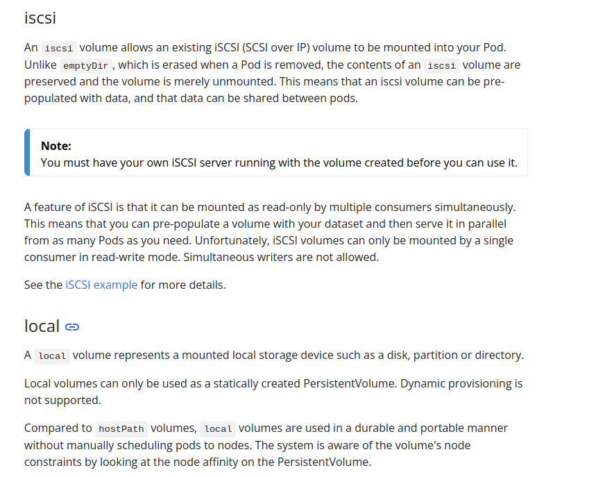

## Requested Report 
Nodeport services are assigned a ClusterIp that can be accessed within the cluster through it that can then forward to the 3 worker nodes selected by it.

## Lab 5
----------------------
- What is a Service in Kubernetes, and why is it needed?

a Service is a method for exposing a network application that is running as one or more Pods in your cluster.

- What are the different types of Services in Kubernetes (e.g., ClusterIP, NodePort) and what are their use cases?

ClusterIP
    Exposes the Service on a cluster-internal IP. Choosing this value makes the Service only reachable from within the cluster. This is the default that is used if you don't explicitly specify a type for a Service. You can expose the Service to the public internet using an Ingress or a Gateway.
NodePort
    Exposes the Service on each Node's IP at a static port (the NodePort). To make the node port available, Kubernetes sets up a cluster IP address, the same as if you had requested a Service of type: ClusterIP.
LoadBalancer
    Exposes the Service externally using an external load balancer. Kubernetes does not directly offer a load balancing component; you must provide one, or you can integrate your Kubernetes cluster with a cloud provider.
ExternalName
    Maps the Service to the contents of the externalName field (for example, to the hostname api.foo.bar.example). The mapping configures your cluster's DNS server to return a CNAME record with that external hostname value. No proxying of any kind is set up.

- what ar LoadBalancer, ExternalName service in kuberenetes and what are their use cases?
LoadBalancer
    Exposes the Service externally using an external load balancer. Kubernetes does not directly offer a load balancing component; you must provide one, or you can integrate your Kubernetes cluster with a cloud provider.
ExternalName
    Maps the Service to the contents of the externalName field (for example, to the hostname api.foo.bar.example). The mapping configures your cluster's DNS server to return a CNAME record with that external hostname value. No proxying of any kind is set up.

- How does a Kubernetes Service use selectors to identify the Pods it routes traffic to? Can a Service be created without a selector?
Using label to compare values like name and color
It can be but the service will assign to any pod available in the cluster
- Explain how a NodePort service works in Kubernetes. What are its advantages and limitations?
assigns all pods with a static port .Its limitations are the port limits of 30000-32727 for external connection.
Its advantages is that it load balances among the available pods and exposes them using a static port number 

- What is a Headless Service in Kubernetes, and when would you use it? How does it differ from a standard ClusterIP service?
Sometimes you don't need load-balancing and a single Service IP. In this case, you can create what are termed headless Services, by explicitly specifying "None" for the cluster IP address (.spec.clusterIP).

You can use a headless Service to interface with other service discovery mechanisms, without being tied to Sometimes you don't need load-balancing and a single Service IP. In this case, you can create what are termed headless Services, by explicitly specifying "None" for the cluster IP address (.spec.clusterIP).

You can use a headless Service to interface with other service discovery mechanisms, without being tied to Kubernetes' implementation.Kubernetes' implementation.
The difference is that the standard has a clusterip assigned to it and can be only accessed from within the cluster.

- Create a ClusterIP Service:
	Write a YAML definition for a ClusterIP service that exposes a deployment named my-app running on port 8080. Ensure the service maps to port 80 inside the cluster.
	[Part1](lab5/p1.yaml)
- Set up a NodePort Service:
	Create a NodePort service that exposes a deployment named backend on port 30001 of each node. 
[Part2](lab5/p2.yaml)
[Pod to test](lab5/p2.1.yaml)

- Test Service with Selectors:
	Create a ClusterIP service named web-service with the selector app: 0ld-web. Deploy two sets of Pods, one with the label app: old-web and another with the label app: api. Verify that only the web Pods receive traffic.
    [first pod](lab5/p3.1.yaml) [the selector](lab5/p3.yaml) [second pod](lab5/3.2.yaml)
The api deployment : 

old-web : 

- Change Service Selector:
	Update an existing service to change its selector from app: old-web to app: new-web. Verify that the traffic is now routed only to Pods with the new label.
[updated yaml to update the selector](lab5/p3.4.yaml)

- Configure a Service for Multiple Ports:
	Define a service that exposes multiple ports (e.g., 80 for HTTP and 443 for HTTPS) on a deployment named multi-port-app "get the front in app from your own choice". Verify both ports are accessible within the cluster.
https port closed from nginx

## Lab 6
1- What is a volume in Kubernetes, and how does it differ from a container's storage?
 a directory containing data accessible to containers in a given pod.

2- What are the different types of volumes available in Kubernetes? Describe at least three types and their use cases.

3- How do PersistentVolumes (PVs) and PersistentVolumeClaims (PVCs) work together in Kubernetes? Explain their relationship and purpose.

4- Create a Pod with an emptyDir volume:
	Write a YAML definition for a Pod that uses an emptyDir volume to share data between two containers within the Pod. Deploy the Pod and verify that the data is shared.

[Config file](<lab 6/p1.yaml>)
5- Set up a Pod with a hostPath volume:
	Define a Pod that mounts a hostPath volume to access files from the host node’s file system. Deploy the Pod and verify that it can read/write to the specified directory on the host.

[config file](<lab 6/p2.yaml>)

6- Deploy a PersistentVolume (PV) and PersistentVolumeClaim (PVC):
	Create a YAML file to define a PersistentVolume of 5Gi with ReadWriteOnce access mode. Then, create a PersistentVolumeClaim requesting 2Gi of storage from this PV. Deploy both resources and verify the PVC is bound to the PV.

[PVC](<lab 6/p3.1.yaml>)
[PV](<lab 6/p3.2.yaml>)

7- Create a Pod that uses a PVC:
	Write a YAML definition for a Pod that uses the PVC created in Exercise 3. Mount the PVC to a specific path inside the container and test that the storage is accessible.

8- Dynamic Provisioning of Persistent Volumes:
	Create a StorageClass that uses a dynamic provisioner (e.g., AWS EBS, GCE Persistent Disk, or NFS). Deploy a PVC that requests storage dynamically using this StorageClass. Verify that the storage is dynamically provisioned.

9- Use a configMap as a Volume:
	Create a ConfigMap with some configuration data. Write a Pod YAML definition that mounts this ConfigMap as a volume and verify the data is correctly mounted and accessible inside the container.

10- Create a Pod with a secret as a Volume:
	Define a Kubernetes Secret containing sensitive data. Create a Pod that mounts this secret as a volume and verify the data is correctly mounted and accessible inside the container in a secure way.

11- Set up a Pod with a gitRepo volume:
	Write a YAML definition for a Pod that uses a gitRepo volume to clone a Git repository into the container. Verify that the repository's contents are available inside the container.

12- Resize a Persistent Volume Claim (PVC):
	Create a PVC and bind it to a Pod. After deployment, resize the PVC to request more storage (assuming the underlying storage provider supports resizing). Verify that the PVC has been resized successfully.

13- Use subPath for mounting volumes:
	Create a Pod with a single volume and use the subPath feature to mount different subdirectories of that volume to different paths within a container. Verify that each path in the container corresponds to the correct subdirectory on the volume.

